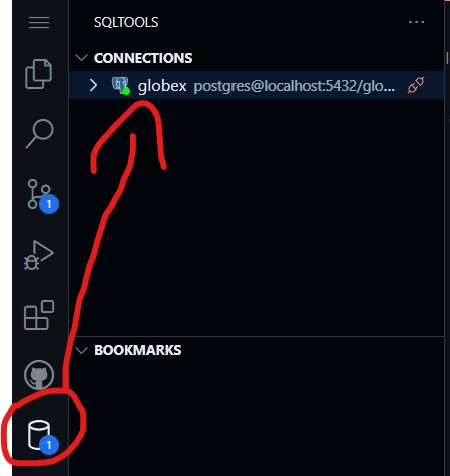

# Globex Database Exercise

## Pre-requisites

To run this locally you will need to have the following tools installed:

* [Docker](https://www.docker.com/products/docker-desktop)

### Visual Studio Code Extensions

There are extensions for Visual Studio Code that let you connect to PostgreSQL database. We recommend using [SQLTools](https://marketplace.visualstudio.com/items?itemName=mtxr.sqltools) with [a PostgreSQL Driver](https://marketplace.visualstudio.com/items?itemName=mtxr.sqltools-driver-pg).

## First time setup

Ensure that docker is running on your machine by using `docker ps`.
From command line, in this directory run the startup script appropriate for your shell. (Either `startup.bat` or `startup.sh`; Powershell & `startup.bat` recommended on Windows as Git Bash will not run some of the commands).

## Connect to the database

Check that the container is running with `docker ps`, you should see something like the following:

```text
CONTAINER ID   IMAGE       COMMAND                  CREATED         STATUS                   PORTS                    NAMES
<SOME_ID>      module-10   "powershell -Command…"   3 minutes ago   Up 3 minutes (healthy)   0.0.0.0:1433->1433/tcp   module-10-container
```

If it isn't, run `docker start module-10-container` to start it. If you stop the container for any reason (e.g. restarting your machine) you'll need to run this command.

You can connect to the database with the following details:  
```
Server name: `localhost`  
Port Number: 5432
Database name: `globex`
Username: `postgres`  
Password: `Password123!`
```
A working connection should already be setup for you. You can access the connection by clicking the SQLTools icon on the Activity bar in VSCode:


You can also create a connection by selecting "Add New Connection" and choosing "PostgreSQL".
